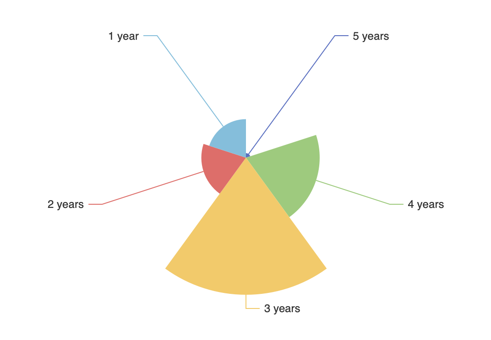

# JDA-12: Visualization Site 📈

&nbsp;&nbsp;&nbsp;&nbsp; Everything related to visualization. <br />

<span>


</span>

&nbsp;&nbsp;&nbsp;&nbsp; [References issue JDA-12](https://solvestack.atlassian.net/browse/JDA-12?atlOrigin=eyJpIjoiZjMzZjNkNjBjMTIxNDYyNGJmZWJiZDc0MmU2YzY4OTciLCJwIjoiaiJ9)


## Preliminaroes

If you already have `pyenv`, `virtualenv`, and `poetry` correctly  setup on your system, kudos. You can ignore the following steps.

If your `pyenv`, or `poetry` is not working, see what steps apply to you but make sure you remove the troublesome application and any of it's remnants on your `PATH` before you begin (check your path).

## Setup

1. Make sure you have [`pyenv`](https://github.com/pyenv/pyenv) or [`virutalenv`](https://virtualenv.pypa.io/en/latest/) installed
2. Install a version of `python` you want: `pyenv install 3.7.12`, flask supports `python > 3.7`
3. Go into your working dir and make sure that `.python-version` file exists. 
4. Initialize pyenv: `pyenv local 3.7.12`
5. Make certain by running: `pyenv versions`, it should be stared in a list. It should not be `system` 

## After installation

1. Add the following to you `.zshrc` and `.zprofile` or `.bashrc` and `.profile`

 ```sh
 export PYENV_ROOT="$HOME/.pyenv"
 command -v pyenv >/dev/null || export path="$PYENV_ROOT/bin:$PATH"
 eval "$(pyenv init -)"
 eval "$(pyenv virtualenv-init -)"
 ```

2. `source .zprofile` or `source .profile`

Alternatively, to restart your shell and see changes reflected;
make sure tht your `virtualenv` is not running
in your interactive shell run `exec "$SHELL`

3. Check that you are using the version of `python` you want;

```sh
	$which python
	$which pip
```

Your `PATH` should contain directories to the installed locations of `python` and `pip` installed by `pyenv`

## Setting up a virtual environment

1. Create a virtual environment: `virtualenv venv` and activate it `source venv/bin/activate`
2. Make sure that your virtual environment, `venv` is excluded in your `.gitignore` before proceeding.

## Alernative virtual environment

Alternatively, you can setup a virtual environment via `poetry` 

### Linux
1. Install poetry `pip install --user poetry` and check that you have it `
	poetry --version`

2. Run `poetry init` to create a `.toml` config file in an empty folder

3. `poetry config virtualenvs.prefer-active-python true`

4. `poetry install`


5. To drop into the virtual environment `poetry shell` however, this can be 
	buggy so an alternative is to activate it manually:
	<br />
	`source "$( poetry env list --full-path | grep Activated | cut -d' ' -f1 )/bin/activate"`
	<br />
	And to make it simpler, create an alias in your `~/.profile` for bash or `~/.zprofile` and `.bashrc` or `.zshrc` for `zsh`;
	<br />
	```sh
	alias activate_="source \"\$(poetry env list --full-path | grep Activated | cut -d' ' -f1 )/bin/activate\""
	```
	<br />
6. `poetry add $( cat dev-requirements.txt )  to install all the required python packages

### MacOS users

1. https://stackoverflow.com/questions/59206956/install-psycopg2-failed-on-macos


Run the activation command in a valid `poetry` package / directory. 
It should have a `.toml` somewhere
Your terminal should look sth like `(jda-py3.7)`

See [Flask-Extensions](https://www.fullstackpython.com/flask-extensions-plug-ins-related-libraries.html) for a full list of flask-extensions. 

Psycopg2 requires some other host dependencies:

```bash
sudo apt install || brew install postgresql
sudo apt install || brew install openssl
sudo apt install || brew link openssl
```

To deactivate a `poetry virtualenv`: `source deactivate`

## Stuck?

Just Ask!

## Running the app

Servers
```sh
1. flask ( development server )
2. gunicorn ( recommended )
3. mod_wsgi - universal
4. uWSGI 
```

Make sure you're in the same directory as `app.py` or your `main` app ( which runs the app ). 

To enable debugging and set the environment variable run `flask run --debug` or enable it in your main app.

Three ways to run the app;

1. `export FLASK_APP=JDA-12` and `flask run` ( development only )
2. `gunicorn  JDA-12:jda` where `jda` is the `flask` object.
3. `waitress-serve --host 127.0.0.1 JDA-12:jda`


If you app's name is something other than `app.py` then;

`flask run --app app_name.py` for example; `flask run --app main.py` 

`gunicorn main:jda`  where `main` is the module and `jda` is the `flask` app. 

When running from a `poetry` activated (`JDA`) `virtualenv` set the flask variable `export FLASK_APP = JDA-12` and simply run `flask run`


## TODO

`Build local first`

1. User login, make it possible for users to login using SSO
2. Get running to store data to `postgres_db` 
3. Design ML models to train on data and run them in the cloud

	* `pytorch`
	* `sci-kit learn`

4. Run `text-miner` (`nltk`) program on an `ec2` instance. (need `boto3` installed via poetry)

## Getting the data

0. Design models for the data
1. Build a working scrapper 

## Goals

1. Have a scrapper load jobs data into the database
	1.1 Scrapper should query db before indeed ( more on this later )
	1.2 If db result is empty then indeed response should be parsed into `db` or an `s3` bucket
2. Build dashboard to visualize jobs data from `db`, integrate with results from `4`:`ec2` above
3. Testing, testing, some more testing
4. Machine learning. See `4` above.
